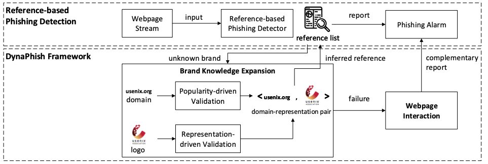

# DynaPhish
Official repository for "Knowledge Expansion and Counterfactual Interaction for Reference-Based Phishing Detection".
Published in USENIX Security 2023.

## Introduction

In this work, we propose Dynaphish as a remedy for reference-based phishing detection, going beyond the predefined reference list. 
Dynaphish assumes a runtime deployment scenario and
(1) actively expands a dynamic reference list, and
(2) supports the detection of _brandless_ webpages with convincing counterfactual explanations. 
For the former, we propose a legitimacy-validation technique for the genuineness of the expanding references. 
For the latter, we propose a counterfactual interaction technique to verify the webpage's legitimacy even without brand information. 
To evaluate Dynaphish, we constructed the largest _dynamic_ phishing dataset consisting of 6344 interactable phishing webpages, to the best of our knowledge. 
Our experiments show that Dynaphish significantly enhances the recall of the state-of-the-art by 28% at a negligible cost of precision. 
Our controlled wild study on the emerging webpages further shows that Dynaphish significantly
(1) improves the state-of-the-art by finding on average 9 times more real-world phishing webpages and
(2) discovers many unconventional brands as the phishing targets.

## Framework



Dynaphish enhances the detection of the state-of-the-art when an unknown webpage (i.e., $b = null$) is detected,
consisting of a Brand Knowledge Expansion module and a Webpage Interaction module.
Given a new webpage $w$,
the Brand Knowledge Expansion module utilizes the $domain(w)$ and $rep(w)$ to mitigate
the limitation of the predefined $\mathcal{R}$.
We design validation techniques to validate the legitimacy of $domain(w)$ via estimating its popularity on the Internet.
Then, a new reference $ref = (domain(w), rep(w))$ will be created.
In addition, for some non-indexed webpages on the Internet,
we use the brand representation $rep(w)$ to further validate its domain legitimacy.
If such a domain-representation pair can be extracted and validated,
Dynaphish includes it as a reference to enhance $\mathcal{R}$.

If Dynaphish is unable to extract the domain-representation pair, we consider the webpage $w$ to be brandless. 
In this case, we use the Webpage Interaction module to evaluate its suspiciousness by utilizing our designed behavioral invariants.

## Project Structure
```
|_ knowledge_expansion: Knowledge Expansion Module
|_ field_study_logo2brand: testing scripts
```

## Setup
Requirements
- CUDA 11

Implemented and tested on Ubuntu 16.04 and 20.04, CUDA 11.1, cuDNN 10.1. 
Should work on other debian-based systems as well.
1. Install the required packages by
```
chmod +x setup.sh
./setup.sh
```
This script will create a new conda environment called **myenv**.
2. Update the configuration file for knowledge expansion module
```
chmod +x update_config.sh
./update_config.sh
```
3. Create a [google cloud service account](https://console.cloud.google.com/), setup the billing details
    - Create a project, enable "Custom Search API", "Cloud Vision API"
    - For "Custom Search API", get the API Key and Search Engine ID following this [guide](https://developers.google.com/custom-search/v1/overview).
    - Create a blank txt file in directory "knowledge_expansion/api_key.txt", copy and paste your API Key and Search Engine ID into the txt file like the following:
     ```text 
      [YOUR_API_KEY]
      [YOUR_SEARCH_ENGINE_ID]
     ```
    - For "Cloud Vision API", download the JSON key following this [guide](https://cloud.google.com/vision/docs/setup), save the JSON file under "knowledge_expansion/discoverylabel.json"

4. The main script is field_study_logo2brand/dynaphish_main.py
```
python -m field_study_logo2brand.dynaphish_main --folder [folder_to_test, e.g. datasets/test_sites] 
```

## References